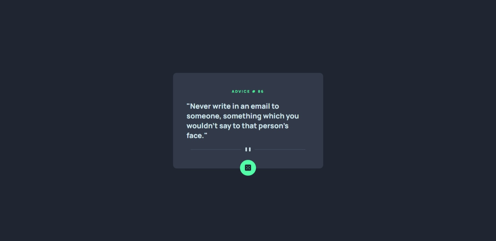
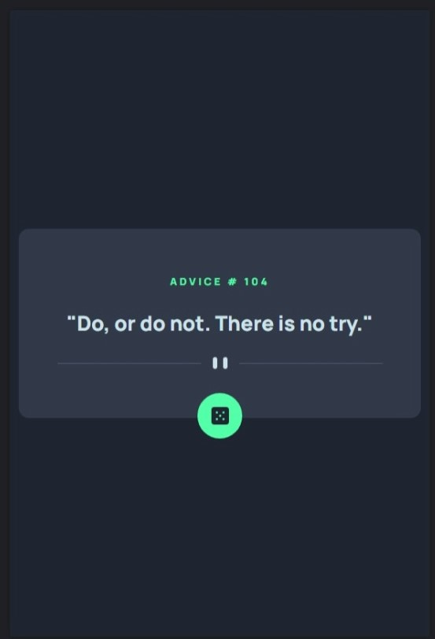

<h1 align="center"> Advice generator app</h1>
<h2 align="center"><a href="https://rafaelestevan.github.io/advice-generator-app/">Live</a> | <a href="https://www.frontendmentor.io/challenges/advice-generator-app-QdUG-13db">Challange</a></h2>
<h2 align="center">Screenshots</h3>

# Built with
* Semantic HTML5 markup
* CSS custom properties
* Flex
* JavaScript
* Fetch API
* [Advice Slip API](https://api.adviceslip.com/)

# Author
* FrontEnd Mentor [Rafael Estevan](https://www.frontendmentor.io/profile/RafaelEstevan)
* LinkedIn [Rafael Estevan](https://www.linkedin.com/in/rafael-estevan/)
* Twitter [@RafaEstevan_](https://twitter.com/RafaEstevan_)
